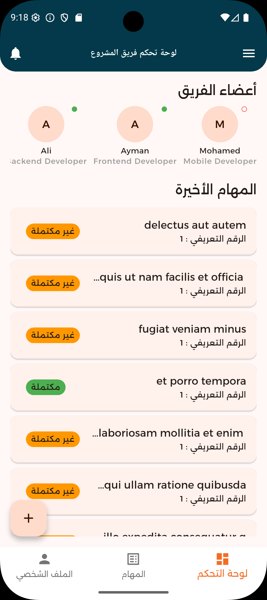
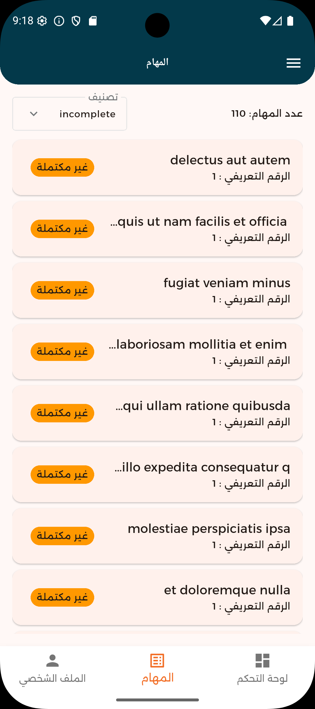
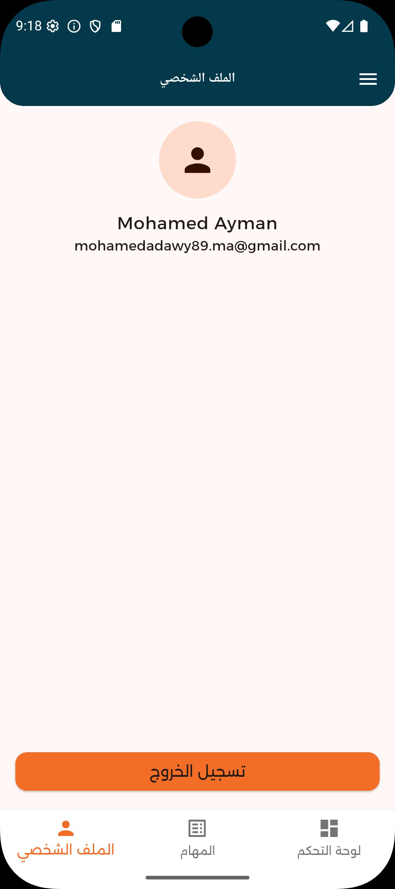
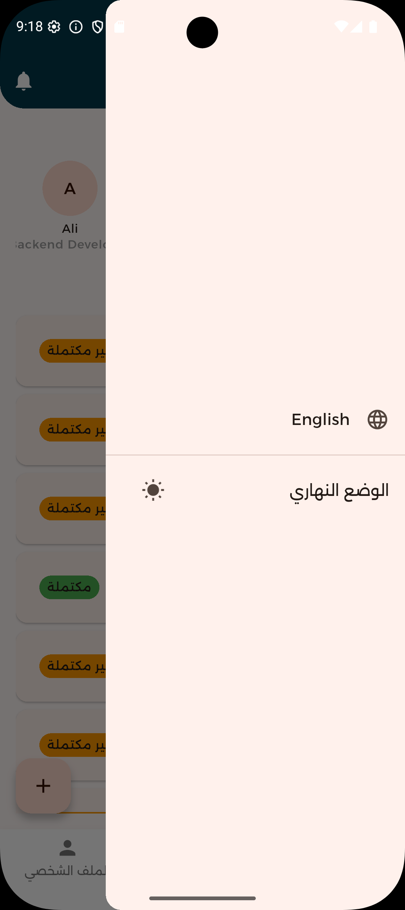
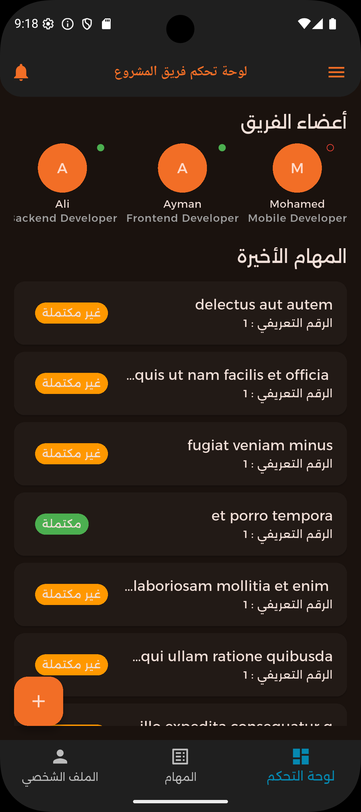
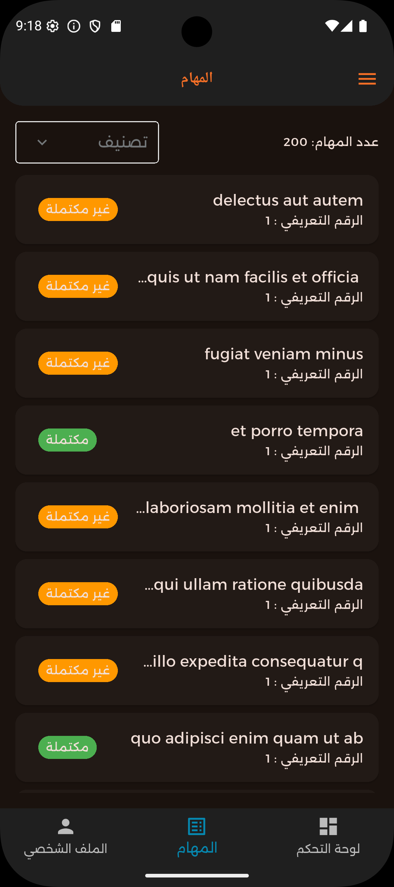

# 📱 Project Team Dashboard (Flutter)

Flutter app with Riverpod for managing team tasks.

---

## 🚀 Setup Instructions

### Prerequisites
- Flutter SDK 3.29.3
- Android/iOS emulator or real device
- Internet access

### Steps

1. **Extract the project** (including the `lib` folder and `pubspec.yaml`) into a Flutter project directory.
2. Open the project in your preferred IDE (VS Code, Android Studio, etc.).
3. Run:
   ```bash
   flutter pub get
   flutter run
   ```
## 📷 Screenshots (Optional)
## Screenshots









## 🛠 Project Structure

```
lib/
├── core/
│   ├── components/       # Shared reusable widgets
│   ├── data/             # Constants 
│   ├── global/           # Navigator key, .
│   ├── services/         # Theme, network, log.
│
├── features/
│   ├── dashboard/
│   │   ├── presentation/ # Views, viewmodels, widgets
│   │   ├── data/         # Model, repository impl
│   │   └── domain/       # Usecases, repo interface
│   │
│   ├── tasks/
│   │   ├── presentation/
│   │   ├── data/
│   │   └── domain/
│   │
│   └── profile/
│       ├── presentation/
│       ├── data/
│       └── domain/
│
└── main.dart
```

---

## 🧠 State Management

All business and UI logic is managed using **Riverpod** providers:


---


